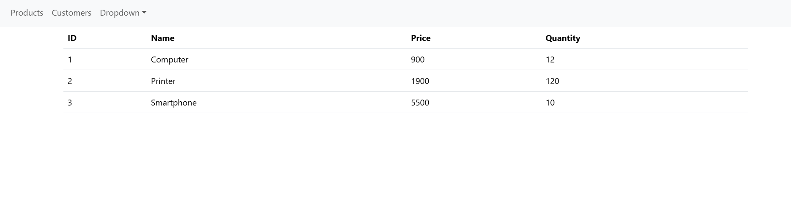

# Mise en oeuvre de micro-services avec Spring Cloud

<h2>L'architecture de projet. </h2>

## 💻 Partie Backend

<h2>Utilisation d'un service de configuration <strong>config-service</strong> qui va regrouper les paramètres de chacune des microservices</h2>

## 💻 Partie Frontend

L'interface utilisateur est conçue avec **Angular**, garantissant une expérience utilisateur fluide, réactive et moderne. Ce choix permet de créer des applications dynamiques et performantes tout en facilitant la maintenance et l'évolutivité.
---

### Fonctionnalités
1. **Gestion des clients** : Affichage de la liste des clients.
2. **Gestion des produits** : Affichage de la liste des produits.
3. **Gestion des commandes** : Affichage des factures et des détails des commandes.
---

### 📚 Technologies utilisées
- **🅰️ Angular** : Framework pour le frontend.
- **📦 Bootstrap** : Design responsive et moderne.
---
### 🖼️ Démonstration Frontend

#### Products

#### Customers  

####  dropdown menu

